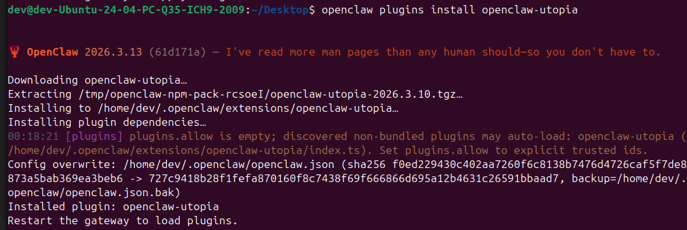
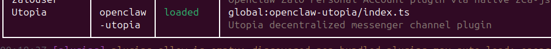
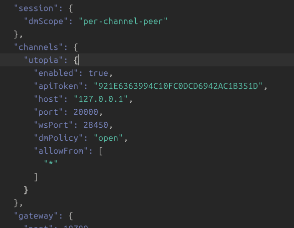
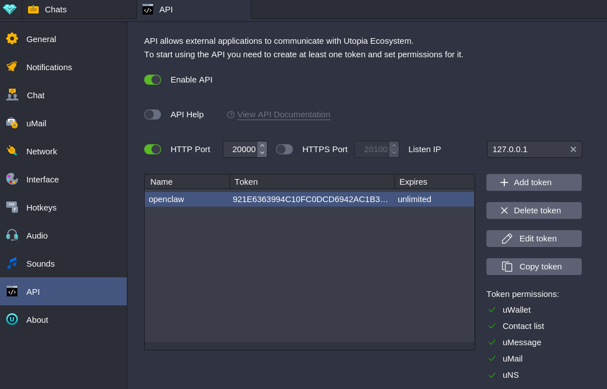
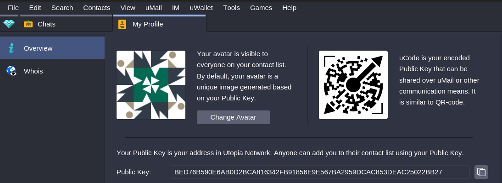
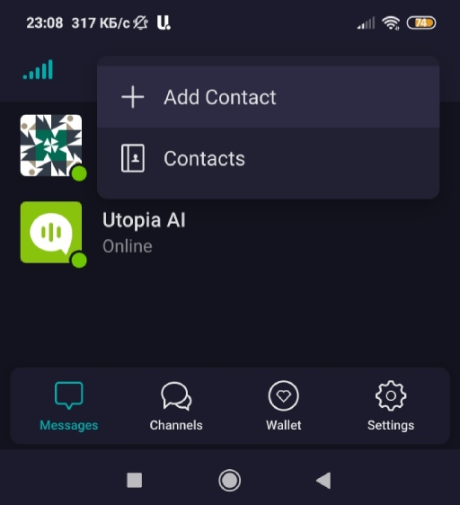
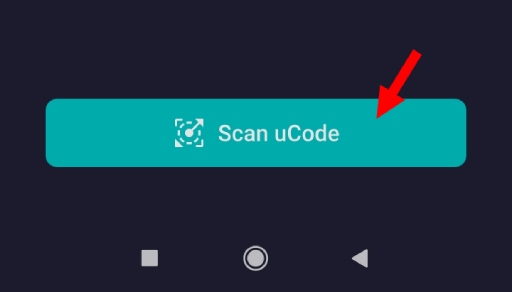
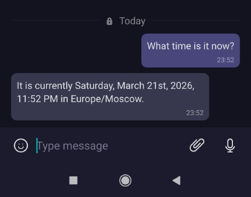

### Installing the plugin

After installing Openclaw, run:

```bash
openclaw plugins install openclaw-utopia
```

Then you will see this:



```bash
openclaw plugins list
```

Then you will see something like:



OK! The plugin is installed, now all that's left is to configure it.

### Option 1. Via the settings file

Make changes to your settings file `~/.openclaw/openclaw.json`



Here is an example of the settings:
```
"channels": {
    "utopia": {
        "enabled": true,
        "apiToken": "API_TOKEN",
        "host": "HOST_FROM_UTOPIA_SETTINGS",
        "port": PORT_FROM_UTOPIA_SETTINGS(HTTP),
        "wsPort": 25000,
        "dmPolicy": "allowlist",
        "allowFrom": [
            "PUBKEY"
        ]
    }
}
```

If the "channels" section is not in your settings file, just add it.

### Option 2. Via commands

```
openclaw config set channels.utopia.enabled true

openclaw config set channels.utopia.
apiToken "921E6363994C10FC0DCD6942AC1B351D"

openclaw config set channels.utopia.host "127.0.0.1"

openclaw config set channels.utopia.port 20000

openclaw config set channels.utopia.wsPort 25000

openclaw config set channels.utopia.dmPolicy "pairing"
```

### More about the parameters

- `apiToken` - Utopia API token.
- `host` - this is the IP of the host where your Utopia server is located.
- `port` - the port you specified in the Utopia API settings.
- `wsPort` - any port to connect the plugin to the Utopia server.
- `dmPolicy` - connection method:

-- `allowlist`: allow only those users whose public key is in the allowed list `allowFrom`.

-- `pairing`: connect users manually.

-- `open`: approve connection for everyone (NOTE: enable this only for debugging!). In this case, the `allowFrom` list must contain the value `["*"]`

-- `disabled`: disable the channel.

To be able to send messages to your server, create accounts from which you will send requests, copy their public keys, and specify them in the settings.

I'll be using the Utopia mobile app to communicate with the server, so I linked my public key from my smartphone account (to `allowFrom` list & `dmPolicy` = `allowlist`).

### Setting up the Utopia API

You'll need a computer (or virtual server) with Utopia installed. Next, create an API key:



- Listen IP: `127.0.0.1` (if openclaw is installed on the same machine)
- Port: `20000` (by default)
- Grant permissions to uMessage & Contact list.

Copy your API key and use it in the plugin settings. 

### Let's check how everything works

Launch the openclaw gateway if it is not already running: `openclaw gateway start` or `openclaw gateway restart`

Next, I'll try to send a message to the server, using a mobile application for this (Utopia).

To find the server's uCode (public key image), I went into my profile information, then scanned the code in the mobile app and authorized the server contact.



Then i added a new contact like this:





I'm trying to send a request:



It works!

---

If you encounter any problems, please see the [README](../README.md) for solutions.
